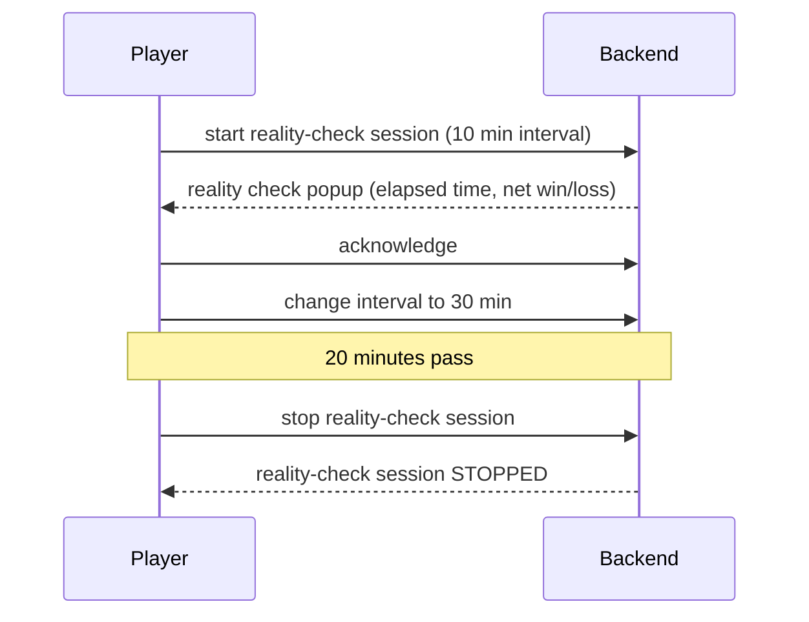

# Reality Check service

A small backend service for our **Reality Check** responsible-gaming feature.

While a player is in a gaming session, the service periodically triggers frontend to show them a *reality check*:
a popup reminder of how long they have been playing and their net win/loss so far, so they can
actively check in on their own wellbeing and acknowledge it. The service keeps, per player, the
state of their current reality-check session (interval, elapsed time, net amount, and when the
next check is due).

This repository is a self-contained starting point. It builds and runs on its own with no
access to any internal systems.

## Example flow



## Tech stack

- Java 25
- Spring Boot 4.1
- Spring Web + JDBI v3
- H2 in-memory database, started in **MySQL compatibility mode**
- Liquibase (schema + seed data applied automatically on startup)
- springdoc-openapi / Swagger UI
- [ShedLock](https://github.com/lukas-krecan/ShedLock) (JDBC-backed) — coordinates the scheduled
  refresh job across replicas so only one instance runs it per tick
- Maven

## Running it

### With Docker (recommended)

```bash
docker compose up --build
```

### Locally with Maven

Requires JDK 25.

```bash
mvn clean package
java -jar target/reality-check-legacy.jar
```

The service starts on port `8080` under the context path `/reality-check`.
On startup Liquibase creates the schema (`player`, `reality_check_session`,
`reality_check_acknowledgement`, `shedlock`) and seeds a few rows.

## API documentation

- Swagger UI: http://localhost:8080/reality-check/swagger-ui.html
- OpenAPI JSON: http://localhost:8080/reality-check/v3/api-docs
- H2 console: http://localhost:8080/reality-check/h2-console
  (JDBC URL `jdbc:h2:mem:realitycheck`, user `sa`, empty password)

## Seeded data

| Player ID | Franchise | Reality-check session |
|-----------|-----------|-----------------------|
| 1001      | 10        | ACTIVE, 60 min interval |
| 1002      | 10        | ACTIVE, 30 min interval |
| 1003      | 20        | none yet |

## Example requests

```bash
BASE=http://localhost:8080/reality-check

# Current reality-check status for a player
curl "$BASE/players/1001/reality-check"

# Start a new session, or update the interval of an existing one
curl -X POST "$BASE/players/1003/reality-check" \
  -H "Content-Type: application/json" \
  -d '{"intervalMinutes": 45}'

# Record that the player acknowledged a reality-check prompt
curl -X POST "$BASE/players/1001/reality-check/acknowledgements"

# Stop a player's reality-check session
curl -X POST "$BASE/players/1002/reality-check/stop"
```

All timestamps in responses (`lastPromptAt`, `nextCheckAt`, `acknowledgedAt`) are formatted in the
player's own timezone, e.g. `"6 July 26 14:35"`.

---

## Design decisions

**Endpoints redesigned as REST resources.**
The original `/realitycheck/getStatus/{id}`-style, verb-in-path endpoints were replaced with
resource-oriented paths under `/players/{playerId}/reality-check` (`GET` for status, `POST` to
start/resume, `POST /stop`, `POST /acknowledgements`). Combined with proper OpenAPI annotations,
the goal is that another developer or QA can largely guess how to call the API from its shape
alone, without needing to ask.

**Acknowledgement history is an append-only table, not a column.**
Compliance's requirement ("every time a player acknowledges... persisted... for reporting
purposes") implies a full history is needed, not just the most recent acknowledgement. A single
`acknowledged_at` column on the session would lose all but the latest acknowledgement as soon as
a session is stopped and a new one starts, so acknowledgements are stored in their own
`reality_check_acknowledgement` table instead, one row per acknowledgement.

**Two separate fixes for multi-replica correctness, not one.**
Running as multiple Kubernetes replicas exposed two independent problems:
- The service previously cached each player's session in a local in-memory map. Each replica has
  its own memory, so replicas could disagree about a session's state (e.g. one replica serving a
  stale "ACTIVE" status after another replica stopped the session). The cache was removed
  entirely; the database is the single source of truth all replicas share.
- The scheduled refresh job ran independently on every replica with no coordination, so with N
  replicas a player due for a reminder would get N duplicate prompts. This is fixed with
  `@SchedulerLock` (ShedLock), which ensures only one replica executes a given tick.

Separately, read-modify-write races on individual session rows (two requests, or a request racing
the scheduled job) are handled with **optimistic locking**: a `version` column checked in the
`UPDATE ... WHERE id = :id AND version = :version` clause, with a small retry loop when a write
loses the race. This matters even with a single replica, and matters more as replica count grows.

**Player data trimmed to what this service needs.**
The original player model exposed the full player table (balance, KYC status, risk score, etc.).
This service only ever needs a player's franchise and timezone, so the read model (`PlayerInfo`)
was narrowed accordingly — unnecessary exposure of sensitive fields this service has no reason to
touch.

## Known limitations / possible next steps

- **No automated tests yet.** Given more time, unit tests on `RealityCheckService` (mocking the
  repositories) would be the first priority, followed by a couple of integration tests around the
  optimistic-locking retry behaviour.
- **`status` is a `String`** (`"ACTIVE"` / `"STOPPED"`) rather than a Java `enum`. Left as-is to
  keep the diff focused, but an enum would be safer against typos.
- **Validation is limited to `intervalMinutes`.** `playerId` isn't bounds-checked at the API
  boundary; invalid IDs currently surface as a clean 404 via `PlayerNotFoundException`, which is
  acceptable but could be made more explicit with request validation.
- Sessions are H2 in-memory, which is fine for this assignment's scope, but note that a real
  multi-replica deployment would need a shared database (the schema is already written in
  MySQL-compatible SQL for this reason) rather than each replica having its own in-memory store.

---

## Assignment

This service is functional but has grown organically and now needs some attention. You have been
handed the following requests from around the company. Treat them the way you would treat real tickets in the backlog. 
Be ready to explain your decisions.

1. **Engineering — pay down the debt.**
   The team needs this legacy service refactored to remove technical debt and make it future-proof.
   Improve the structure, naming and correctness where you see fit.

2. **QA — make the API usable and documented.**
   QA frequently has to ask developers how to call these endpoints because the current API
   documentation is not informative. Make the API and its generated documentation clear and usable.

3. **Tech Ops — scale out.**
   Tech Ops plans to increase the replica count in Kubernetes and has asked everyone to make sure
   their service behaves correctly when running as more than one instance.

4. **Compliance — persist acknowledgement timestamps.**
   Compliance requires that every time a player acknowledges a reality check, the exact date and time
   of that acknowledgement is persisted in the database for reporting purposes.

5. **Frontend (React) — return a formatted timestamp.**
   The frontend has asked for date and time data to be returned formatted in the player's own time zone
   (the `timezone` field stored on the player record).
   The proposed format is: day as a number, month as the full word, 2-digit year, then hours and
   minutes in 24 h format, with no time-zone suffix.
   Example: `"6 July 26 14:35"`

You are free to change anything in the codebase, add dependencies, extend the infrastructure in
`docker-compose.yml`, and add new Liquibase change sets as needed. AI usage is encouraged.
